# Attendance Live Facial Recognition - Development Instructions

## App Description & Feature Specification

Build a Framework7 v9 - Cordova-based mobile application for live facial recognition attendance tracking system. The app captures student faces in real-time, identifies them, and automatically records their time-in and time-out, submitting attendance data to the backend server.

### Core Features & Requirements:

1.  **Live Facial Recognition** Real-time camera feed with face detection and recognition. Automatic student identification using trained face models. Support for multiple face detection in a single frame. Confidence score display for recognition accuracy. Face detection bounding boxes with student name overlay.

2.  **Attendance Recording** 
    - Automatic time-in recording when student face is recognized
    - Automatic time-out recording on subsequent recognition
    - **Enforced alternating sequence**: Must time-out before next time-in (prevents duplicate check-ins)
    - Unlimited daily cycles: Students can time-in/out multiple times per day
    - Duplicate prevention window: 5 seconds between same student detections
    - Real-time attendance status display (In/Out)
    - Automatic parent SMS notifications for both time-in and time-out
    - Local storage fallback when offline, sync when online
    
    **Validation Rules:**
    - If last record has NO time-out → Force time-out (cannot time-in again)
    - If last record has time-out → Allow time-in (new cycle)
    - Query uses proper column aliases to prevent name collision
    - Comprehensive console logging with emoji indicators for debugging

3.  **Student Database Management** Student profile management (ID, Name, Photo, Course, Year). Face encoding storage and updates. Student search and filter functionality. Bulk student import via CSV/Excel. Student photo capture and update.

4.  **Local Database Storage (SQLite)** All data stored locally on device using SQLite. No backend server required. Student profiles and face encodings stored in local database. Attendance records saved to local SQLite database. Complete offline operation. Optional cloud backup (Google Drive, Dropbox) for data safety. Export database file for manual backup. Local network sharing for multi-device access (optional).

5.  **Admin Dashboard** View live attendance feed. Attendance reports (daily, weekly, monthly). Export attendance to Excel/PDF/CSV. Email reports automatically. Student management (add, edit, delete). Face model training and updates. System settings and configuration. Database backup and restore. Import students from Excel/CSV.

6.  **Attendance Reports** Daily attendance summary. Individual student attendance history. Late arrivals and early departures tracking. Absence notifications. Graphical attendance analytics. Filter by date range, course, year level.

7.  **Permissions & Camera Management** 
    - **Unified Permission System**: Uses `cordova-plugin-android-permissions` for all runtime permissions
    - **Permissions Requested**: SMS (SEND_SMS, READ_PHONE_STATE), Camera (CAMERA), Audio (RECORD_AUDIO)
    - **Request Timing**: All permissions requested together on home page load
    - **Native Dialogs**: Android shows native permission dialogs with proper rationale
    - **Fallback Support**: iOS/browser falls back to getUserMedia for camera/audio
    - **Permission Flow**:
      - Home page → Request all 3 permissions (SMS, Camera, Audio)
      - Camera page → Verify permissions, start camera
      - First attendance → Check SMS permission, send notification
    - Front/back camera switching
    - Flash/torch control for low-light conditions
    - Camera resolution settings
    - Frame rate optimization
    - Manual capture button for fallback

8.  **Security & Privacy** Secure face encoding storage (encrypted in SQLite). User authentication (Admin/Operator roles). Access control and permissions. Audit logs for attendance modifications. GDPR compliance for face data. PIN/Password protection for app access. Encrypted database backups. No data transmitted over internet (maximum privacy).

9.  **Theming & UI** Primary color: #4CAF50 (Green - representing presence/check-in) Secondary color: #232B2B (Dark Charcoal) Accent color: #FF5722 (Red - for check-out/alerts) Background color: #FFFFFF (Light mode) / #1a1f1f (Dark mode) Dark mode enabled with automatic theme switching support Modern, clean UI optimized for camera viewfinder and recognition display.

10. **Additional Features** Local notifications for attendance confirmations. QR code fallback for manual check-in. Voice confirmation for successful recognition. Attendance statistics and trends. Multi-language support. Automatic database backup scheduling. Email/share reports directly from app. Battery optimization for continuous camera usage. Local network server mode (optional for multi-device access).

### Implementation Guidelines:

Implement all features with clear separation of concerns:
- Use Cordova plugins: Camera, SQLite Storage, File System, Email Composer, Local Notifications
- Integrate face-api.js or TensorFlow.js Lite for facial recognition (runs locally)
- Use SQLite database for all data storage (students, attendance, settings)
- Implement local-only architecture - no backend server required
- Optional: Local network HTTP server for multi-device report access
- Ensure real-time performance (< 500ms recognition time)
- Optimize camera frame processing for battery efficiency
- Implement automatic database backup to cloud storage (Google Drive/Dropbox)
- Include comprehensive error handling and logging
- Provide clear user feedback for all recognition states
- Export functionality for Excel/PDF/CSV reports

## App Flow & Navigation

### Basic Application Flow


### Attendance Validation Flow (Detailed)

```mermaid
flowchart TD
    FaceRecog([Face Recognized<br/>Confidence > 70%]) --> GetStudentId[Get Student ID]
    GetStudentId --> QueryDB[📊 Query getTodayAttendance]
    
    QueryDB --> SQLQuery["SQL with Aliases:<br/>a.id as attendance_id<br/>s.id (student PK)"]
    SQLQuery --> FilterRecords[Filter: r.id === studentId]
    
    FilterRecords --> CountRecords{Record Count?}
    
    CountRecords -->|0 records| FirstTime[🆕 FIRST TIME TODAY]
    CountRecords -->|≥1 records| GetLastRecord[Get Most Recent Record]
    
    FirstTime --> ActionTimeIn1[Action: TIME-IN]
    
    GetLastRecord --> CheckTimeOut{last_record.time_out<br/>exists?}
    
    CheckTimeOut -->|NULL/Empty| HasNoTimeOut[⏰ HAS NO TIME-OUT]
    CheckTimeOut -->|Has Value| HasTimeOut[✅ HAS TIME-OUT]
    
    HasNoTimeOut --> ActionTimeOut[Action: TIME-OUT]
    HasTimeOut --> ActionTimeIn2[Action: TIME-IN<br/>New Cycle]
    
    ActionTimeIn1 --> CallRecordTimeIn1[db.recordTimeIn]
    ActionTimeIn2 --> CallRecordTimeIn2[db.recordTimeIn]
    ActionTimeOut --> CallRecordTimeOut[db.recordTimeOut]
    
    CallRecordTimeIn1 --> InsertSQL1["INSERT INTO attendance<br/>time_in = now<br/>time_out = NULL"]
    CallRecordTimeIn2 --> InsertSQL2["INSERT INTO attendance<br/>time_in = now<br/>time_out = NULL"]
    CallRecordTimeOut --> UpdateSQL["UPDATE attendance<br/>SET time_out = now<br/>WHERE id = last_record.id"]
    
    InsertSQL1 --> SendNotif1[📱 sendParentNotification<br/>status: 'in']
    InsertSQL2 --> SendNotif2[📱 sendParentNotification<br/>status: 'in']
    UpdateSQL --> SendNotif3[📱 sendParentNotification<br/>status: 'out']
    
    SendNotif1 --> SMSIn1[SMS: Arrived at school]
    SendNotif2 --> SMSIn2[SMS: Arrived at school]
    SendNotif3 --> SMSOut[SMS: Left school]
    
    SMSIn1 --> Success1[✅ Time-in recorded]
    SMSIn2 --> Success2[✅ Time-in recorded<br/>New Cycle]
    SMSOut --> Success3[✅ Time-out recorded]
    
    Success1 --> ShowToast1[Toast + Console Log]
    Success2 --> ShowToast2[Toast + Console Log]
    Success3 --> ShowToast3[Toast + Console Log]
    
    ShowToast1 --> ContinueDetection([Continue Face Detection])
    ShowToast2 --> ContinueDetection
    ShowToast3 --> ContinueDetection
    
    style FirstTime fill:#2196F3,stroke:#1565C0,color:#fff
    style HasNoTimeOut fill:#FF9800,stroke:#E65100,color:#fff
    style HasTimeOut fill:#4CAF50,stroke:#2E7D32,color:#fff
    style ActionTimeIn1 fill:#4CAF50,stroke:#2E7D32,color:#fff
    style ActionTimeIn2 fill:#4CAF50,stroke:#2E7D32,color:#fff
    style ActionTimeOut fill:#FF5722,stroke:#D32F2F,color:#fff
    style Success1 fill:#4CAF50,stroke:#2E7D32,color:#fff
    style Success2 fill:#4CAF50,stroke:#2E7D32,color:#fff
    style Success3 fill:#FF5722,stroke:#D32F2F,color:#fff
```



### Permission Request Flow


### SMS Notification Flow

```mermaid
flowchart TD
    AttendanceRecorded([Attendance Recorded]) --> CallNotif[sendParentNotification<br/>studentId, status]
    
    CallNotif --> GetStudent[Get Student Details from DB]
    GetStudent --> CheckContact{parent_contact<br/>exists?}
    
    CheckContact -->|No| LogNoContact[ℹ️ No parent contact]
    CheckContact -->|Yes| HasContact[Has Contact: +639...]
    
    HasContact --> InitNotif[notifications.init]
    InitNotif --> CheckSMSPerms{smsPermissionGranted?}
    
    CheckSMSPerms -->|Yes| PrepareSMS[Prepare SMS Message]
    CheckSMSPerms -->|No| ReqSMSPerm[requestSMSPermission]
    
    ReqSMSPerm --> CheckPerm{Check Permission}
    CheckPerm -->|Granted| SetFlag[smsPermissionGranted = true]
    CheckPerm -->|Denied| PermDenied[❌ Permission Denied]
    
    SetFlag --> PrepareSMS
    
    PrepareSMS --> BuildMsg["Build Message:<br/>Time-In: 'arrived at school'<br/>Time-Out: 'left school'"]
    
    BuildMsg --> SetOptions["SMS Options:<br/>replaceLineBreaks: false<br/>android.intent: ''<br/>(Silent Send)"]
    
    SetOptions --> SendSMS[smsPlugin.send]
    
    SendSMS --> SMSResult{Send Result}
    
    SMSResult -->|Success| SMSSuccess[✅ SMS Sent Successfully<br/>Console: SMS sent in background]
    SMSResult -->|Error| SMSError[❌ SMS Send Error<br/>Console: Error details]
    
    SMSSuccess --> NotifResult[Return: { sms: true }]
    SMSError --> NotifResult2[Return: { sms: false }]
    PermDenied --> NotifResult2
    LogNoContact --> NotifResult2
    
    NotifResult --> ShowToast[Toast: Parent notified via SMS]
    NotifResult2 --> SilentFail[Silent Failure<br/>No Toast]
    
    ShowToast --> Done([Done])
    SilentFail --> Done
    
    style SMSSuccess fill:#4CAF50,stroke:#2E7D32,color:#fff
    style NotifResult fill:#4CAF50,stroke:#2E7D32,color:#fff
    style ShowToast fill:#4CAF50,stroke:#2E7D32,color:#fff
    style SMSError fill:#FF5722,stroke:#D32F2F,color:#fff
    style PermDenied fill:#FF5722,stroke:#D32F2F,color:#fff
    style LogNoContact fill:#FF9800,stroke:#E65100,color:#fff
    style SilentFail fill:#9E9E9E,stroke:#616161,color:#fff
```

### Database Query Flow (Column Alias Fix)

```mermaid
flowchart TD
    Query([getTodayAttendance Called]) --> GetDate[Get Current Date<br/>YYYY-MM-DD]
    GetDate --> BuildSQL[Build SQL Query]
    
    BuildSQL --> Aliases["Use Column Aliases:<br/>a.id as attendance_id<br/>a.student_id as student_db_id<br/>s.id (keeps name)<br/>s.student_id (keeps name)"]
    
    Aliases --> JoinTables[JOIN attendance a<br/>with students s]
    JoinTables --> WhereClause[WHERE attendance_date = today]
    WhereClause --> OrderBy[ORDER BY a.time_in DESC]
    
    OrderBy --> ExecuteSQL[Execute SQL Query]
    ExecuteSQL --> Results[Get Result Rows]
    
    Results --> CheckCollision{Column Name<br/>Collision?}
    
    CheckCollision -->|❌ Without Aliases| Collision["PROBLEM:<br/>s.student_id overwrites<br/>a.student_id<br/>Filter breaks!"]
    
    CheckCollision -->|✅ With Aliases| NoCollision["CORRECT:<br/>All columns unique<br/>a.id → attendance_id<br/>s.id → id"]
    
    Collision --> WrongFilter["Filter uses:<br/>r.student_id<br/>(wrong value - string)"]
    NoCollision --> CorrectFilter["Filter uses:<br/>r.id<br/>(correct value - integer)"]
    
    WrongFilter --> NoMatch[❌ No matches found<br/>Bug: Can't find records]
    CorrectFilter --> MatchFound[✅ Records found<br/>Validation works]
    
    NoMatch --> MultipleTimeIns[Bug: Multiple Time-Ins<br/>without Time-Out]
    MatchFound --> ProperValidation[Proper Validation:<br/>Check time_out field]
    
    ProperValidation --> ValidFlow[✅ Correct Flow:<br/>Time-In → Time-Out → Time-In]
    
    MultipleTimeIns --> Error([❌ Duplicate Check-Ins])
    ValidFlow --> Success([✅ Unlimited Cycles Work])
    
    style NoCollision fill:#4CAF50,stroke:#2E7D32,color:#fff
    style CorrectFilter fill:#4CAF50,stroke:#2E7D32,color:#fff
    style MatchFound fill:#4CAF50,stroke:#2E7D32,color:#fff
    style ProperValidation fill:#4CAF50,stroke:#2E7D32,color:#fff
    style ValidFlow fill:#4CAF50,stroke:#2E7D32,color:#fff
    style Success fill:#4CAF50,stroke:#2E7D32,color:#fff
    style Collision fill:#FF5722,stroke:#D32F2F,color:#fff
    style WrongFilter fill:#FF5722,stroke:#D32F2F,color:#fff
    style NoMatch fill:#FF5722,stroke:#D32F2F,color:#fff
    style MultipleTimeIns fill:#FF5722,stroke:#D32F2F,color:#fff
    style Error fill:#FF5722,stroke:#D32F2F,color:#fff
```



### User Journey & Screen Flow

```
1. Login Screen
   ├─ Admin Login (Dashboard access)
   └─ Operator Login (Recognition only)
   
2. Splash/Loader Screen
   ├─ Load face models
   ├─ Initialize camera
   ├─ Check permissions
   └─ Sync with backend
   
3. Main Dashboard (Role-based)
   ├─ Admin → Full Dashboard
   └─ Operator → Recognition Screen
   
4. Main Navigation (Bottom Toolbar)
   ├─ Live Recognition (default selected)
   ├─ Attendance Records
   ├─ Students
   └─ Settings/Profile
```

### Live Recognition Screen (Primary Screen)

The Recognition screen is the main interface with the following layout:

**Camera Viewfinder Section:**
- Full-screen camera preview (landscape/portrait adaptive)
- Live face detection overlay (bounding boxes)
- Real-time recognition status indicators
- Confidence score display per detected face
- Student name overlay on recognized faces

**Recognition Controls:**
- Camera switch button (front/back)
- Flash/torch toggle
- Manual capture button
- Pause/Resume recognition toggle
- Recognition sensitivity slider

**Live Attendance Feed:**
- Recent check-ins list (last 10 entries)
- Student photo, name, time, status (IN/OUT)
- Color-coded status badges (Green=In, Red=Out)
- Slide-up panel to view full list
- Pull to refresh for updates

**Status Bar (Top):**
- Current date and time
- Database status indicator
- Last backup time badge
- Battery level (if low during camera use)
- Active session count

**Bottom Toolbar Navigation:**
- Live Recognition Tab (current page)
- Attendance Records Tab
- Students Tab
- Settings Tab

### Theme Configuration

**Default Theme: Light Mode (for better camera visibility)**
- App launches in light mode by default for camera screens
- Primary: #4CAF50 (Green - Check-in/Present)
- Accent: #FF5722 (Red - Check-out/Alert)
- Secondary: #232B2B (Dark Charcoal - Text)
- Background: #FFFFFF (Light mode default)
- Camera overlay: Semi-transparent dark for better contrast
- Dark mode available in settings for low-light environments

### Page Hierarchy

```
Login Screen (index)
├── Admin Login
│   └── (Success) → Admin Dashboard
├── Operator Login
│   └── (Success) → Recognition Screen
│
Admin Dashboard (Authenticated - Admin Role)
├── Live Recognition (Default Tab)
│   ├── Camera Viewfinder
│   ├── Face Detection Overlay
│   ├── Real-time Recognition
│   ├── Live Attendance Feed
│   └── Recognition Controls
│       ├── Camera Switch
│       ├── Flash Toggle
│       ├── Manual Capture
│       └── Sensitivity Settings
├── Attendance Records (Tab)
│   ├── Today's Attendance
│   ├── Attendance History
│   ├── Search & Filter
│   │   ├── By Student
│   │   ├── By Date Range
│   │   ├── By Status (In/Out/Late/Absent)
│   │   └── By Course/Year
│   ├── Individual Record Details
│   ├── Export Reports (Excel/PDF)
│   └── Attendance Analytics
│       ├── Daily Summary Graph
│       ├── Weekly Trends
│       ├── Monthly Statistics
│       └── Late/Absent Patterns
├── Students (Tab)
│   ├── Student List (searchable)
│   ├── Add New Student
│   │   ├── Basic Info Form
│   │   ├── Photo Capture
│   │   └── Face Encoding Training
│   ├── Student Details
│   │   ├── Personal Information
│   │   ├── Attendance History
│   │   ├── Update Photo
│   │   └── Retrain Face Model
│   ├── Bulk Import (CSV/Excel)
│   └── Student Categories
│       ├── By Course
│       ├── By Year Level
│       └── Active/Inactive Status
└── Settings (Tab)
    ├── Account Settings
    │   ├── Profile Information
    │   ├── Change Password
    │   └── Logout
    ├── Camera Settings
    │   ├── Resolution
    │   ├── Frame Rate
    │   ├── Default Camera (Front/Back)
    │   └── Flash Preference
    ├── Recognition Settings
    │   ├── Confidence Threshold
    │   ├── Duplicate Time Window
    │   ├── Face Detection Sensitivity
    │   └── Auto Check-out Time
    ├── Backup & Restore
    │   ├── Automatic Backup Schedule
    │   ├── Cloud Backup (Google Drive/Dropbox)
    │   ├── Manual Backup
    │   ├── Restore from Backup
    │   └── Email Database File
    ├── Export Settings
    │   ├── Auto-Email Daily Reports
    │   ├── Export Format (Excel/PDF/CSV)
    │   ├── Report Recipients
    │   └── Local Network Sharing (Enable/Disable)
    ├── App Preferences
    │   ├── Theme Toggle (Light/Dark)
    │   ├── Language
    │   ├── Notifications
    │   └── Sound Effects
    └── System Information
        ├── App Version
        ├── Face Model Version
        ├── Last Backup Time
        ├── Database Size
        └── Storage Usage

Operator Dashboard (Authenticated - Operator Role)
├── Live Recognition (Only Tab)
│   └── (Same as Admin Recognition Screen)
└── Settings (Limited)
    ├── Camera Settings
    ├── Theme Toggle
    └── Logout
```

### Implementation Notes

1. **Camera Integration**: Use Cordova Camera Preview plugin for continuous camera access
2. **Face Recognition**: Integrate face-api.js or TensorFlow.js Lite models (runs locally on device)
3. **Local Storage**: Use cordova-plugin-sqlite-2 for all data storage (no backend required)
4. **Performance**: Use Web Workers for face processing to keep UI responsive
5. **Permissions**: Use `cordova-plugin-android-permissions` for all runtime permissions (SMS, Camera, Audio)
6. **Authentication**: Local password/PIN with role-based access control (Admin/Operator)
7. **Data Backup**: Implement automatic backup to Google Drive/Dropbox using Cordova File plugin
8. **Export Reports**: Use cordova-plugin-email-composer to share reports via email
9. **Import Students**: Parse Excel/CSV files using SheetJS library for bulk student import
10. **Error Handling**: Graceful fallbacks for camera errors, recognition failures, storage issues
11. **Multi-Device**: Optional local HTTP server mode for accessing reports from other devices on same network

### Attendance Validation Flow (Critical Implementation)

**Database Query Fix (Prevents Column Name Collision):**
```javascript
// ✅ CORRECT - Uses proper aliases
async getTodayAttendance() {
  const date = new Date().toISOString().split('T')[0];
  const sql = `
    SELECT 
      a.id as attendance_id,
      a.student_id as student_db_id,
      a.attendance_date,
      a.time_in,
      a.time_out,
      a.status,
      a.confidence,
      a.photo_path,
      s.id,
      s.student_id,
      s.first_name,
      s.last_name,
      s.course,
      s.year_level,
      s.photo_path as student_photo
    FROM attendance a
    INNER JOIN students s ON a.student_id = s.id
    WHERE a.attendance_date = ?
    ORDER BY a.time_in DESC
  `;
  return await this.query(sql, [date]);
}
```

**Camera Page Validation Logic:**
```javascript
// ✅ CORRECT - Forces time-out before allowing next time-in
const handleRecognitionResult = async (match) => {
  const studentId = match.student.id;
  
  // Check if student has any attendance today
  const todayRecords = await db.getTodayAttendance();
  const studentTodayRecords = todayRecords.filter(r => r.id === studentId);
  
  console.log(`📋 Student ${match.student.first_name} has ${studentTodayRecords.length} record(s) today`);
  
  if (studentTodayRecords.length > 0) {
    const lastRecord = studentTodayRecords[0]; // Most recent (already sorted DESC)
    
    if (!lastRecord.time_out) {
      // Has time-in but NO time-out → Must time-out
      console.log('⏰ Last record has no time-out, recording TIME-OUT...');
      await db.recordTimeOut(studentId, match.confidence);
      await sendParentNotification(studentId, 'out');
      showToast(`✓ Time-out recorded: ${match.student.first_name} ${match.student.last_name}`);
    } else {
      // Has time-out → Allow new time-in
      console.log('✅ Last record complete (has time-out), recording new TIME-IN...');
      await db.recordTimeIn(studentId, match.confidence);
      await sendParentNotification(studentId, 'in');
      showToast(`✓ Time-in recorded: ${match.student.first_name} ${match.student.last_name}`);
    }
  } else {
    // First attendance today → Time-in
    console.log('🆕 First attendance today, recording TIME-IN...');
    await db.recordTimeIn(studentId, match.confidence);
    await sendParentNotification(studentId, 'in');
    showToast(`✓ Time-in recorded: ${match.student.first_name} ${match.student.last_name}`);
  }
};
```

**Key Validation Rules:**
1. **Unlimited Daily Cycles**: Students can time-in/out unlimited times per day
2. **Enforced Alternating**: Cannot time-in twice without time-out in between
3. **Automatic Time-Out**: If last record has no time-out, forces time-out before allowing time-in
4. **Column Aliases**: Uses `a.id as attendance_id` and `s.id` to prevent SQL name collision
5. **Console Logging**: Comprehensive logging with emojis (📋, ⏰, ✅, 🆕) for debugging

### Permission Management System

**Unified Permission Flow (All Platforms):**

1. **Home Page (`home.f7`)** - Initial permission request:
```javascript
const requestPermissions = async () => {
  if (window.cordova?.plugins?.permissions) {
    const permissions = window.cordova.plugins.permissions;
    
    const permissionsToRequest = [
      permissions.SEND_SMS,
      permissions.CAMERA,
      permissions.RECORD_AUDIO
    ];
    
    // Request all 3 permissions at once
    permissions.requestPermissions(permissionsToRequest, (status) => {
      const hasSMS = status.SEND_SMS === permissions.PERMISSION_GRANTED;
      const hasCamera = status.CAMERA === permissions.PERMISSION_GRANTED;
      const hasAudio = status.RECORD_AUDIO === permissions.PERMISSION_GRANTED;
      
      console.log('📱 Permission details:', {
        SMS: hasSMS ? '✅ Granted' : '❌ Denied',
        Camera: hasCamera ? '✅ Granted' : '❌ Denied',
        Audio: hasAudio ? '✅ Granted' : '❌ Denied'
      });
    });
  } else {
    // iOS/browser fallback - use getUserMedia
    await requestPermissionsFallback();
  }
};
```

2. **Camera Page (`camera.f7`)** - Runtime permission check:
```javascript
const requestCameraPermission = async () => {
  if (window.cordova?.plugins?.permissions) {
    const permissions = window.cordova.plugins.permissions;
    
    permissions.requestPermissions([permissions.CAMERA, permissions.RECORD_AUDIO], (status) => {
      if (status.hasPermission || status.CAMERA === permissions.PERMISSION_GRANTED) {
        console.log('✅ Camera permission granted via Cordova');
        startCamera();
      } else {
        requestCameraPermissionFallback();
      }
    });
  } else {
    // Fallback for iOS/browser
    await requestCameraPermissionFallback();
  }
};
```

3. **SMS Notification (`notifications.js`)** - Auto-send SMS:
```javascript
async sendSMS(phoneNumber, message) {
  if (!this.smsPermissionGranted) {
    const granted = await this.requestSMSPermission();
    if (!granted) return false;
  }
  
  const options = {
    replaceLineBreaks: false,
    android: {
      intent: '' // Empty string = silent background send (no composer)
    }
  };
  
  return new Promise((resolve) => {
    smsPlugin.send(phoneNumber, message, options, 
      () => {
        console.log('✅ SMS sent successfully in background');
        resolve(true);
      },
      (error) => {
        console.error('❌ SMS send error:', error);
        resolve(false);
      }
    );
  });
}
```

**Permission Request Timing:**
- **App Launch (Home Page)**: Request all 3 permissions (SMS, Camera, Audio) together
- **Camera Page Load**: Verify camera permission, start camera if granted
- **First Attendance Record**: Check SMS permission before sending notification
- **Subsequent Attendances**: No permission dialogs (already granted)

**Console Log Pattern:**
```
🔐 Requesting SMS, Camera, and Audio permissions...
📱 Permission status: { hasPermission: true }
📱 Permission details:
  SMS: ✅ Granted
  Camera: ✅ Granted
  Audio: ✅ Granted
✅ Permissions granted via Cordova
```

## Framework7 v9 Development Guidelines

When developing features for this application, always follow the official 
Framework7 v9 documentation and best practices. Refer to these essential 
resources:

### Core Concepts
- **Events**: https://framework7.io/docs/events
- **Routes**: https://framework7.io/docs/routes
- **Router Component**: https://framework7.io/docs/router-component
- **View**: https://framework7.io/docs/view
- **Store**: https://framework7.io/docs/store
- **App**: https://framework7.io/docs/app
- **Package**: https://framework7.io/docs/package

### Layout & Styling
- **App Layout**: https://framework7.io/docs/app-layout
- **Init App**: https://framework7.io/docs/init-app
- **Safe Areas**: https://framework7.io/docs/safe-areas
- **Color Themes**: https://framework7.io/docs/color-themes
- **Typography**: https://framework7.io/docs/typography
- **CSS Variables**: https://framework7.io/docs/css-variables
- **Theme-Based Rendering**: https://framework7.io/docs/theme-based-rendering

### UI Components
- **Framework7 Components**: https://framework7.io/docs/
- **Accordion**: https://framework7.io/docs/accordion
- **Action Sheet**: https://framework7.io/docs/action-sheet
- **Area Chart**: https://framework7.io/docs/area-chart
- **Autocomplete**: https://framework7.io/docs/autocomplete
- **Badge**: https://framework7.io/docs/badge
- **Block**: https://framework7.io/docs/block
- **Breadcrumbs**: https://framework7.io/docs/breadcrumbs
- **Button**: https://framework7.io/docs/button
- **Calendar**: https://framework7.io/docs/calendar
- **Cards**: https://framework7.io/docs/cards
- **Checkbox**: https://framework7.io/docs/checkbox
- **Chips**: https://framework7.io/docs/chips
- **Color Picker**: https://framework7.io/docs/color-picker
- **Contacts List**: https://framework7.io/docs/contacts-list
- **Data Table**: https://framework7.io/docs/data-table
- **Dialog**: https://framework7.io/docs/dialog
- **Floating Action Button**: https://framework7.io/docs/floating-action-button
- **Form**: https://framework7.io/docs/form
- **Gauge**: https://framework7.io/docs/gauge
- **Grid**: https://framework7.io/docs/grid
- **Icons**: https://framework7.io/docs/icons
- **Infinite Scroll**: https://framework7.io/docs/infinite-scroll
- **Inputs**: https://framework7.io/docs/inputs
- **Link**: https://framework7.io/docs/link
- **List Button**: https://framework7.io/docs/list-button
- **List View**: https://framework7.io/docs/list-view
- **List Index**: https://framework7.io/docs/list-index
- **Login Screen**: https://framework7.io/docs/login-screen
- **Menu List**: https://framework7.io/docs/menu-list
- **Messagebar**: https://framework7.io/docs/messagebar
- **Messages**: https://framework7.io/docs/messages
- **Navbar**: https://framework7.io/docs/navbar
- **Notification**: https://framework7.io/docs/notification
- **Page**: https://framework7.io/docs/page
- **Panel**: https://framework7.io/docs/panel
- **Photo Browser**: https://framework7.io/docs/photo-browser
- **Picker**: https://framework7.io/docs/picker
- **Pie Chart**: https://framework7.io/docs/pie-chart
- **Popover**: https://framework7.io/docs/popover
- **Popup**: https://framework7.io/docs/popup
- **Preloader**: https://framework7.io/docs/preloader
- **Progressbar**: https://framework7.io/docs/progressbar
- **Pull to Refresh**: https://framework7.io/docs/pull-to-refresh
- **Radio**: https://framework7.io/docs/radio
- **Range Slider**: https://framework7.io/docs/range-slider
- **Searchbar**: https://framework7.io/docs/searchbar
- **Segmented**: https://framework7.io/docs/segmented
- **Sheet Modal**: https://framework7.io/docs/sheet-modal
- **Skeleton**: https://framework7.io/docs/skeleton
- **Smart Select**: https://framework7.io/docs/smart-select
- **Sortable List**: https://framework7.io/docs/sortable-list
- **Statusbar**: https://framework7.io/docs/statusbar
- **Stepper**: https://framework7.io/docs/stepper
- **Subnavbar**: https://framework7.io/docs/subnavbar
- **Swipeout**: https://framework7.io/docs/swipeout
- **Swiper**: https://framework7.io/docs/swiper
- **Tabs**: https://framework7.io/docs/tabs
- **Text Editor**: https://framework7.io/docs/text-editor
- **Timeline**: https://framework7.io/docs/timeline
- **Toast**: https://framework7.io/docs/toast
- **Toggle**: https://framework7.io/docs/toggle
- **Toolbar Tabbar**: https://framework7.io/docs/toolbar-tabbar
- **Tooltip**: https://framework7.io/docs/tooltip
- **Treeview**: https://framework7.io/docs/treeview
- **Virtual List**: https://framework7.io/docs/virtual-list
- **Framework7 Icons**: https://framework7.io/icons/

### Utilities & APIs
- **DOM7**: https://framework7.io/docs/dom7
- **Active State**: https://framework7.io/docs/active-state
- **Utils**: https://framework7.io/docs/utils
- **Device**: https://framework7.io/docs/device
- **Support**: https://framework7.io/docs/support

### Advanced Features
- **Plugins API**: https://framework7.io/docs/plugins-api
- **Lazy Modules**: https://framework7.io/docs/lazy-modules
- **Custom Build**: https://framework7.io/docs/custom-build

### Key Development Practices
1. Always use Framework7 Router Components (.f7 files) for page structure
2. Leverage Framework7 Store for state management across the app
3. Follow Framework7's event system for component communication
4. Use Framework7's built-in color theme system with specified colors
5. Implement proper safe area handling for modern devices
6. Use DOM7 for DOM manipulation instead of jQuery
7. Follow Framework7's app initialization patterns
8. Utilize lazy loading for better performance
9. Support both light and dark mode themes with proper CSS variable usage
10. Use `.theme-dark` class for dark mode specific styles
11. Always wrap array mappings with `$h` tagged template literals in templates
12. Never use plain template literals for array rendering - use `$h\`...\`` pattern

### Framework7 v9 Template Syntax Rules

Framework7 uses **tagged template literals** with the `$h` function for proper virtual DOM rendering. This is critical for arrays and dynamic content.

#### **CRITICAL: Array Mapping Syntax**

**✅ CORRECT - Always use `$h` wrapper for array mappings:**
```javascript
${items.map((item) => $h`
  <li>${item.name}</li>
`)}
```

**❌ INCORRECT - Never use plain template literals for arrays:**
```javascript
// This will render as TEXT, not HTML
${items.map((item) => `
  <li>${item.name}</li>
`)}
```

**Why?** Framework7's virtual DOM engine requires `$h` tagged template literals to properly process and render HTML elements. Without `$h`, the entire HTML renders as plain text strings visible in the UI.

#### **Conditional Rendering**

**✅ Ternary operators with `$h`:**
```javascript
${condition ? $h`<div>True content</div>` : $h`<div>False content</div>`}
```

**✅ Logical AND with `$h`:**
```javascript
${isVisible && $h`<div>Visible content</div>`}
```

#### **Complex Lists with Keys**

For lists that may reorder or change, always include unique `key` attributes:
```javascript
${items.map((item, idx) => $h`
  <li key=${item.id || idx}>
    <span>${item.name}</span>
  </li>
`)}
```

#### **Nested Templates**

When mapping over nested data, wrap each level with `$h`:
```javascript
${groups.map((group) => $h`
  <div class="group">
    <h3>${group.title}</h3>
    <ul>
      ${group.items.map((item) => $h`
        <li>${item.name}</li>
      `)}
    </ul>
  </div>
`)}
```

#### **Event Handlers in Templates**

Always use function references (not string names) with `@` syntax:
```javascript
<button @click=${handleClick}>Click Me</button>
// ✅ Correct - function reference

<button @click="handleClick">Click Me</button>
// ❌ Incorrect - string name won't work
```

#### **Inline Arrow Functions for Events**

Use arrow functions for inline event handlers with parameters:
```javascript
// Navigation with inline arrow function
<a href="#" @click=${() => setFilter('all')}>Filter</a>

// Event with parameter
<button @click=${(e) => editStudent(e, student.id)}>Edit</button>

// Input events
<input @input=${(e) => updateField('studentId', e.target.value)} />

// Prevent default
<a href="#" @click=${(e) => { e.preventDefault(); handleClick(); }}>Link</a>
```

#### **Common Anti-Patterns to Avoid**

| ❌ Don't Do | ✅ Do Instead |
|------------|--------------|
| `${array.map(i => \`<li>${i}</li>\`)}` | `${array.map(i => $h\`<li>${i}</li>\`)}` |
| `${condition && \`<div>text</div>\`}` | `${condition && $h\`<div>text</div>\`}` |
| Helper function returns plain string | Helper function wrapped in template, mapping in template with `$h` |
| `innerHTML` for dynamic lists | Array mapping with `$h` template literals |
| Nested conditionals in template | Move logic to script, use helper functions |

#### **Reference Documentation**

See official Framework7 Router Component documentation:
- https://framework7.io/docs/router-component#mapping-array-to-elements
- https://framework7.io/docs/router-component#component-template
- https://framework7.io/docs/router-component#virtual-dom

### HTML/JSX Syntax Rules


**Asset Import Rules:**
**CRITICAL**: Always import images and videos using ES6 import statements. Never use direct paths in src attributes.

```javascript
// ✅ CORRECT: Import assets
import logoWhite from '../assets/images/logo-white.png';
import heroVideo from '../assets/videos/hero-bg.mp4';

// Use in template

<video src="${heroVideo}"></video>
```

```html
<!-- ❌ INCORRECT: Direct path in src -->

<video src="assets/videos/hero-bg.mp4"></video>
```

**Why Import Assets:**
1. **Build Optimization** - Vite/Webpack can optimize, compress, and cache-bust assets
2. **Type Safety** - Import errors caught at build time, not runtime
3. **Path Resolution** - No broken links from incorrect relative paths
4. **Hot Module Replacement** - Asset changes reload instantly during development
5. **Production URLs** - Automatic CDN/hashed filenames for production builds

**Self-Closing Tags:**
Always use proper self-closing tag syntax with `/` before the closing `>` for void elements.

```html
<!-- ✅ CORRECT: Self-closing tags with / -->

<input type="text" placeholder="Enter text" />
<source src="video.mp4" type="video/mp4" />
<br />
<hr />
<meta name="description" content="Description" />
<link rel="stylesheet" href="styles.css" />

<!-- ❌ INCORRECT: Missing / before > -->

<input type="text" placeholder="Enter text">
<source src="video.mp4" type="video/mp4">
```

**Void Elements Requiring Self-Closing Syntax:**
- ``
- `<input />`
- `<br />`
- `<hr />`
- `<meta />`
- `<link />`
- `<source />`
- `<area />`
- `<base />`
- `<col />`
- `<embed />`
- `<param />`
- `<track />`
- `<wbr />`

**Container Elements (Normal closing):**
```html
<!-- ✅ CORRECT: Normal closing tags for container elements -->
<div></div>
<span></span>
<button></button>
<a></a>
<p></p>
```

### Material Icons Usage

**CRITICAL**: Use Material Icons (not Framework7 Icons) for all icon elements throughout the application for consistency and better cross-platform support.

#### **Icon Implementation**

**✅ CORRECT - Material Icons syntax:**
```html
<!-- Material Icons with proper class structure -->
<i class="icon material-icons">home</i>
<i class="icon material-icons">camera</i>
<i class="icon material-icons">person</i>
<i class="icon material-icons">settings</i>
```

**❌ INCORRECT - Framework7 Icons (do not use):**
```html
<!-- Do NOT use Framework7 Icons -->
<i class="icon f7-icons">house_fill</i>
<i class="icon f7-icons">camera_fill</i>
```

#### **Common Material Icons for This App**

**Navigation Icons:**
- `home` - Home/Dashboard
- `videocam` - Camera/Recognition
- `list` or `assignment` - Attendance Records
- `people` or `person` - Students
- `settings` - Settings

**Action Icons:**
- `add` - Add new item
- `edit` - Edit
- `delete` - Delete
- `save` - Save
- `cancel` or `close` - Cancel/Close
- `search` - Search
- `filter_list` - Filter
- `more_vert` - More options (vertical dots)
- `more_horiz` - More options (horizontal dots)

**Status Icons:**
- `check_circle` - Success/Present
- `cancel` - Error/Absent
- `warning` - Warning/Late
- `info` - Information
- `notifications` - Notifications

**Camera & Recognition:**
- `camera_alt` - Take photo
- `photo_camera` - Camera
- `flash_on` / `flash_off` - Flash toggle
- `flip_camera_ios` - Switch camera
- `face` - Face recognition

**File & Data Icons:**
- `upload_file` - Import
- `download` - Export/Download
- `cloud_upload` - Cloud backup
- `folder` - Files
- `description` - Documents

#### **Icon Sizing**

Use Material Icons sizing classes for consistent icon sizes:

```html
<!-- Small icons (18px) -->
<i class="icon material-icons md-18">home</i>

<!-- Default icons (24px) -->
<i class="icon material-icons">home</i>

<!-- Medium icons (36px) -->
<i class="icon material-icons md-36">home</i>

<!-- Large icons (48px) -->
<i class="icon material-icons md-48">home</i>
```

#### **Icon Colors**

Use CSS classes or inline styles for icon colors:

```html
<!-- Using utility classes -->
<i class="icon material-icons color-primary">check_circle</i>
<i class="icon material-icons color-red">cancel</i>
<i class="icon material-icons color-white">home</i>

<!-- Using inline styles -->
<i class="icon material-icons" style="color: var(--attendance-primary)">check_circle</i>
```

#### **Dynamic Icons (Conditional)**

Use ternary operators for state-based icons:

```html
<!-- Flash toggle example -->
<i class="icon material-icons">${flashOn ? 'flash_on' : 'flash_off'}</i>

<!-- Active state example -->
<i class="icon material-icons">${isActive ? 'check_circle' : 'radio_button_unchecked'}</i>
```

#### **Icon Buttons**

Combine icons with buttons properly:

```html
<!-- Icon-only button -->
<button class="button button-fill">
  <i class="icon material-icons">add</i>
</button>

<!-- Button with icon and text -->
<button class="button button-fill">
  <i class="icon material-icons">camera_alt</i>
  <span>Take Photo</span>
</button>

<!-- Toolbar/navbar icons -->
<a href="#" class="link icon-only">
  <i class="icon material-icons">more_vert</i>
</a>
```

#### **Material Icons Resources**

- **Icon Search**: https://fonts.google.com/icons
- **Material Design Guidelines**: https://material.io/design/iconography
- **Icon Names Reference**: https://material.io/resources/icons/

#### **Setup Requirements**

Ensure Material Icons are properly loaded in your app:

```html
<!-- In index.html or main layout -->
<link href="https://fonts.googleapis.com/icon?family=Material+Icons" rel="stylesheet" />
```

Or via CSS import:

```css
/* In main CSS file */
@import url('https://fonts.googleapis.com/icon?family=Material+Icons');
```

#### **Migration from Framework7 Icons**

If converting existing Framework7 Icons to Material Icons:

| Framework7 Icon | Material Icon | Usage |
|----------------|---------------|-------|
| `house_fill` / `house` | `home` | Home navigation |
| `camera_fill` / `camera` | `videocam` or `camera_alt` | Camera/recognition |
| `person_fill` / `person` | `person` or `people` | User/students |
| `person_2_fill` / `person_2` | `people` | Multiple users |
| `gear_alt_fill` / `gear_alt` | `settings` | Settings |
| `list_bullet` | `list` or `assignment` | Lists/records |
| `doc_text_fill` / `doc_text` | `description` or `assignment` | Documents |
| `arrow_left` | `arrow_back` | Back navigation |
| `checkmark_circle_fill` | `check_circle` | Success |
| `xmark_circle_fill` | `cancel` | Error/close |
| `bolt_fill` / `bolt` | `flash_on` / `flash_off` | Flash |

## Coding Standards & Design System

### Centralized Styling Approach

**IMPORTANT**: Always use centralized styling through CSS variables and reusable classes defined in `app.less`. Never use inline styles or hardcoded values.

#### CSS Variables Usage (from app.less root)
```css
/* Always reference these variables instead of hardcoding values */
--f7-theme-color: #4CAF50
--attendance-primary: #4CAF50      /* Green - Check-in/Present */
--attendance-accent: #FF5722       /* Red - Check-out/Alert */
--attendance-secondary: #232B2B    /* Dark Charcoal - Text */
--attendance-bg: #FFFFFF           /* Background */
--attendance-success: #4CAF50      /* Success states */
--attendance-warning: #FFC107      /* Warning states */
--attendance-error: #F44336        /* Error states */
--attendance-info: #2196F3         /* Info states */
```

**Example - Correct vs Incorrect:**
```css
/* ✅ CORRECT */
color: var(--attendance-primary);
background: var(--attendance-secondary);

/* ❌ INCORRECT */
color: #4CAF50;
background: #232B2B;
```

### Golden Ratio Design System (φ ≈ 1.618)

All sizing, spacing, and typography follow the golden ratio for harmonious design. Base sizes scale using φ multiplier.

#### Typography Scale (Golden Ratio: 1.618)
```css
/* Base: 16px, Scale: ×1.618 */
--font-xs: 10px      /* Base ÷ φ² */
--font-sm: 13px      /* Base ÷ φ */
--font-base: 16px    /* Base (1) */
--font-md: 18px      /* Base × 1.125 */
--font-lg: 22px      /* Base × φ⁰·⁵ */
--font-xl: 26px      /* Base × φ */
--font-2xl: 32px     /* Base × φ¹·² */
--font-3xl: 42px     /* Base × φ¹·⁵ */
--font-4xl: 52px     /* Base × φ² */
--font-5xl: 68px     /* Base × φ²·⁵ */
```

#### Spacing Scale (Golden Ratio: 1.618)
```css
/* Base: 8px, Scale: ×1.618 up to 5x */
--space-0: 0px
--space-1: 8px       /* Base (1×) */
--space-2: 13px      /* Base × φ⁰·⁵ */
--space-3: 16px      /* Base × 2 */
--space-4: 21px      /* Base × φ¹·² */
--space-5: 26px      /* Base × φ¹·⁵ */
--space-6: 32px      /* Base × 4 (2×) */
--space-7: 42px      /* Base × φ² */
--space-8: 52px      /* Base × φ²·² */
--space-9: 68px      /* Base × φ²·⁵ (3×) */
--space-10: 84px     /* Base × φ²·⁷ */
--space-11: 110px    /* Base × φ³ (4×) */
--space-12: 136px    /* Base × φ³·² */
--space-13: 178px    /* Base × φ³·⁵ (5×) */
```

#### Border Radius Scale
```css
--radius-sm: 8px     /* Subtle rounding */
--radius-base: 10px  /* Standard inputs */
--radius-md: 12px    /* Cards */
--radius-lg: 16px    /* Buttons */
--radius-xl: 20px    /* Large buttons */
--radius-2xl: 24px   /* Hero sections */
--radius-full: 9999px /* Circular */
```

#### Card & Component Sizing
```css
/* Heights based on golden ratio */
--height-sm: 32px    /* Small buttons */
--height-base: 44px  /* Touch targets */
--height-md: 52px    /* Medium buttons */
--height-lg: 56px    /* Large buttons */
--height-xl: 68px    /* Extra large */

/* Card dimensions */
--card-padding: 16px
--card-radius: 12px
--card-shadow: 0 2px 8px rgba(0, 0, 0, 0.1)
```

### Reusable Class Naming Convention

#### Utility Classes Pattern
```css
/* Spacing utilities (margin/padding) */
.m-{size}   /* margin: var(--space-{size}) */
.mt-{size}  /* margin-top */
.mb-{size}  /* margin-bottom */
.ml-{size}  /* margin-left */
.mr-{size}  /* margin-right */
.mx-{size}  /* margin horizontal */
.my-{size}  /* margin vertical */

.p-{size}   /* padding: var(--space-{size}) */
.pt-{size}  /* padding-top */
/* ... same pattern for padding */

/* Typography utilities */
.text-xs, .text-sm, .text-base, .text-lg, .text-xl, .text-2xl, .text-5xl
.font-light, .font-normal, .font-medium, .font-semibold, .font-bold
.text-primary, .text-secondary, .text-muted
.text-center

/* Color utilities */
.bg-primary, .bg-secondary, .bg-white, .bg-dark
.color-primary, .color-secondary, .color-white, .color-success, .color-red

/* Border radius utilities */
.rounded-sm, .rounded, .rounded-md, .rounded-lg, .rounded-xl, .rounded-full

/* Flexbox utilities */
.flex, .flex-col, .flex-row, .items-center, .justify-center, .justify-between
.gap-1, .gap-2, .gap-3, .gap-4, .gap-5
.flex-1, .flex-wrap

/* Width utilities */
.w-full

/* Display utilities */
.inline-flex
```

#### Utility Classes Usage in Templates
```html
<!-- Real examples from codebase -->
<div class="flex gap-2 flex-wrap">
  <a href="#" class="chip">All</a>
</div>

<div class="grid grid-cols-3 gap-3">
  <${StatCard} value=${count} label="Total" />
</div>

<button class="button button-outline button-large w-full">
  <i class="icon material-icons mr-2">get_app</i>
  Import
</button>

<div class="flex items-center gap-2 mt-2">
  <span class="badge badge-success">ACTIVE</span>
</div>

<div class="card p-4">
  <i class="icon material-icons text-5xl color-success mb-3">verified</i>
</div>
```

#### Component Classes Pattern
```css
/* BEM-style component classes */
.card { /* Base component */ }
.card__header { /* Component element */ }
.card__body { /* Component element */ }
.card--elevated { /* Component modifier */ }
.card--outline { /* Component modifier */ }

/* Button variants */
.btn-primary, .btn-secondary, .btn-outline, .btn-ghost
.btn-sm, .btn-md, .btn-lg

/* Badge variants */
.badge-success, .badge-error, .badge-info
```

### Class Reusability & Customization

**Principle**: Reuse existing classes across pages for consistency, but extend with custom classes when specific pages require unique designs.

#### Reusing Base Classes
```html
<!-- ✅ Home page: Use base card class -->
<div class="card rounded-lg p-4 bg-white">
  <h2 class="text-xl font-semibold">Home Card</h2>
</div>

<!-- ✅ Profile page: Reuse base card class -->
<div class="card rounded-lg p-4 bg-white">
  <h2 class="text-xl font-semibold">Profile Card</h2>
</div>
```

#### Extending with Custom Classes
```html
<!-- ✅ Recognition page: Add custom class for specific design -->
<div class="card recognition-card rounded-lg p-4">
  <h2 class="text-xl font-semibold">Custom Recognition Card</h2>
</div>

<style scoped>
/* Base card styles are inherited */
.recognition-card {
  background: linear-gradient(135deg, var(--attendance-primary), var(--attendance-secondary));
  color: white;
  border: 2px solid var(--attendance-primary);
}
</style>
```

#### When to Reuse vs Customize

**Reuse existing classes when:**
- The design is similar across pages
- Only minor variations (colors, spacing) are needed
- Maintaining consistency is priority

**Add custom classes when:**
- Page requires unique visual identity
- Complex custom layouts are needed
- Specific functionality requires different styling
- Combining utility classes becomes too verbose

#### Best Practices for Custom Classes

1. **Extend, don't replace** - Keep base class and add custom class
2. **Use descriptive names** - `profile-card`, `hero-banner`, `chat-bubble`
3. **Maintain CSS variable usage** - Even in custom styles, reference root variables
4. **Document purpose** - Add comments explaining why custom class exists
5. **Consider modifiers first** - Try using `card--profile` before creating entirely new class

```html
<!-- ✅ GOOD: Extends base with custom -->
<div class="card card--recognition rounded-lg p-4">...</div>

<!-- ✅ ALSO GOOD: New class for unique design -->
<div class="recognition-hero-card p-6">...</div>

<!-- ❌ BAD: No base class, inline styles -->
<div style="padding: 16px; background: #4CAF50;">...</div>
```

### Implementation Rules

1. **Never use inline styles** - All styling must be in `<style>` blocks or external CSS
2. **Always use CSS variables** - Reference variables from app.less root
3. **Use reusable classes** - Create utility classes for common patterns
4. **Follow golden ratio** - All sizing should follow the defined scales
5. **Maintain consistency** - Use the same class names across all components
6. **DRY principle** - Don't repeat styles, create reusable classes instead
7. **Semantic naming** - Class names should describe purpose, not appearance
8. **Mobile-first** - Base styles for mobile, scale up with media queries
9. **Scoped styles** - Use `scoped` attribute in .f7 component styles when needed
10. **Performance** - Minimize CSS specificity, avoid deep nesting (max 3 levels)

### Centralized .LESS Styling Architecture

**CRITICAL**: Define shared component styles in centralized `.less` files, NOT in individual `.f7` files. This prevents code duplication and ensures consistency across the entire app.

#### Where to Define Styles

**✅ In .less files (src/css/):**
- Component styles used across multiple pages (cards, buttons, forms)
- Utility classes (spacing, typography, colors)
- Layout patterns (grids, flexbox)
- Shared animations and transitions
- Global component variants

**❌ NOT in .f7 `<style>` blocks:**
- Repeated component definitions
- Utility class redefinitions
- Common patterns used elsewhere
- Styles that could be abstracted

#### .f7 `<style>` Block Usage Rules

Use `<style scoped>` in .f7 files **ONLY** for:
1. **Page-specific overrides** that don't apply elsewhere
2. **Unique page layouts** that aren't reusable
3. **One-off styling** for specific page functionality
4. **Context-specific variations** of base components

```html
<!-- ✅ CORRECT: Using centralized classes -->
<template>
  <div class="page">
    <div class="card card--elevated p-4 rounded-lg">
      <h2 class="text-xl font-semibold mb-3">Profile</h2>
      <p class="text-base text-muted">Description</p>
    </div>
  </div>
</template>

<!-- No <style> block needed - all classes from centralized .less -->

<!-- ✅ ALSO CORRECT: Page-specific override only -->
<template>
  <div class="page recognition-page">
    <div class="card recognition-hero-card p-6">
      <h2 class="text-2xl font-bold">Custom Hero</h2>
    </div>
  </div>
</template>

<style scoped>
/* Only page-specific styling that can't be reused */
.recognition-hero-card {
  background: linear-gradient(135deg, var(--attendance-primary), var(--attendance-secondary));
  animation: heroEntrance 0.6s ease-out;
}

@keyframes heroEntrance {
  from { opacity: 0; transform: translateY(20px); }
  to { opacity: 1; transform: translateY(0); }
}
</style>

<!-- ❌ INCORRECT: Redefining common styles in .f7 -->
<template>
  <div class="card">Content</div>
</template>

<style scoped>
/* ❌ BAD: This should be in src/css/components/cards.less */
.card {
  padding: 16px;
  border-radius: 12px;
  background: white;
  box-shadow: 0 2px 8px rgba(0, 0, 0, 0.1);
}
</style>
```

### File Organization

```
attendance-facial-recognition/
├── platforms/              # Cordova platforms (iOS, Android)
├── plugins/                # Cordova plugins
├── www/                    # Production build output
├── src/
│   ├── index.html          # Main HTML entry point
│   ├── js/
│   │   ├── app.js          # App initialization & configuration
│   │   ├── routes.js       # App routes configuration
│   │   ├── store.js        # Framework7 Store for state management
│   │   └── utils/
│   │       ├── database.js # SQLite database setup & queries
│   │       ├── face-recognition.js # Face detection & recognition logic
│   │       ├── camera.js   # Camera management utilities
│   │       ├── storage.js  # File storage & backup utilities
│   │       ├── export.js   # Export to Excel/PDF/CSV
│   │       ├── backup.js   # Cloud backup (Google Drive/Dropbox)
│   │       └── constants.js # App constants
│   ├── pages/              # Framework7 Router Components (.f7 files)
│   │   ├── index.f7        # Login page
│   │   ├── loader.f7       # Splash/Loading screen
│   │   ├── recognition.f7  # Live Recognition page (main screen)
│   │   ├── attendance/
│   │   │   ├── records.f7      # Attendance records list
│   │   │   ├── details.f7      # Individual record details
│   │   │   ├── reports.f7      # Reports & analytics
│   │   │   └── export.f7       # Export functionality
│   │   ├── students/
│   │   │   ├── list.f7         # Student list
│   │   │   ├── add.f7          # Add new student
│   │   │   ├── edit.f7         # Edit student info
│   │   │   ├── details.f7      # Student details & history
│   │   │   ├── import.f7       # Bulk import students
│   │   │   └── photo-capture.f7 # Photo capture for face training
│   │   └── settings/
│   │       ├── settings.f7     # Main settings page
│   │       ├── camera.f7       # Camera settings
│   │       ├── recognition.f7  # Recognition settings
│   │       ├── backup.f7       # Backup & restore settings
│   │       ├── export.f7       # Export settings
│   │       ├── account.f7      # Account settings
│   │       └── about.f7        # System information
│   ├── css/
│   │   ├── app.less        # Root variables & global styles
│   │   ├── framework7-custom.less # Framework7 overrides
│   │   ├── utilities/
│   │   │   ├── spacing.less    # Margin & padding utilities
│   │   │   ├── typography.less # Font utilities
│   │   │   ├── colors.less     # Color utilities
│   │   │   └── layout.less     # Flexbox & grid utilities
│   │   └── components/
│   │       ├── buttons.less    # Button styles
│   │       ├── cards.less      # Card styles
│   │       ├── forms.less      # Form styles
│   │       ├── navigation.less # Navigation & toolbar styles
│   │       ├── camera.less     # Camera viewfinder styles
│   │       ├── recognition.less # Recognition overlay styles
│   │       ├── attendance.less # Attendance feed styles
│   │       └── auth.less       # Authentication pages styles
│   ├── assets/
│   │   ├── images/         # Image assets
│   │   ├── icons/          # Custom icons
│   │   ├── fonts/          # Custom fonts
│   │   └── models/         # Face recognition model files
│   └── components/         # Reusable components
│       ├── BottomToolbar.f7    # Bottom navigation
│       ├── AttendanceCard.f7   # Attendance entry card
│       ├── StudentCard.f7      # Student profile card
│       ├── StatusBadge.f7      # Status indicator badge
│       └── LoadingSpinner.f7   # Loading indicator
├── config.xml              # Cordova configuration
├── package.json            # NPM dependencies
├── framework7.json         # Framework7 CLI configuration
└── .github/
    └── instructions/
        └── attendance-live-recog.instructions.md  # Development guidelines
```

#### How to Add New Shared Components

1. **Identify if style is reusable** - Will it be used on multiple pages?
2. **Create/update .less file** - Add to appropriate file in `src/css/components/`
3. **Follow BEM naming** - Use modifiers for variants (`.card--elevated`)
4. **Use CSS variables** - Reference root variables for all values
5. **Import in app.less** - Ensure it's loaded globally

**Example: Adding new card variant**

```less
// src/css/components/cards.less

.card {
  padding: var(--space-4);
  border-radius: var(--radius-md);
  background: var(--attendance-bg);
  box-shadow: var(--card-shadow);
  
  &--elevated {
    box-shadow: 0 4px 16px rgba(0, 0, 0, 0.15);
  }
  
  &--recognition {
    background: linear-gradient(135deg, var(--attendance-primary), var(--attendance-secondary));
    color: white;
  }
  
  &__header {
    margin-bottom: var(--space-3);
    font-size: var(--font-lg);
    font-weight: 600;
  }
  
  &__body {
    font-size: var(--font-base);
    line-height: 1.6;
  }
}
```

Then use across all pages:
```html
<!-- Recognition page -->
<div class="card card--elevated">...</div>

<!-- Attendance page -->
<div class="card card--recognition">...</div>

<!-- Settings page -->
<div class="card">...</div>
```

### Optimization Best Practices

1. **Check before creating** - Search if class already exists in .less files
2. **Abstract common patterns** - If used 2+ times, move to .less file
3. **Use utility classes** - Combine utilities instead of custom classes when possible
4. **Avoid duplication** - Never copy/paste styles between .f7 files
5. **Follow Framework7 conventions** - Use Framework7's built-in classes first
6. **Minimize .f7 styles** - Keep `<style>` blocks small and page-specific only
7. **Leverage CSS cascade** - Let centralized styles do the work
8. **Document in comments** - Add purpose comments in .less files

### Framework7 v9 Standard Coding Patterns

```html
<!-- ✅ Use Framework7 built-in classes -->
<div class="page">
  <div class="navbar">
    <div class="navbar-bg"></div>
    <div class="navbar-inner">
      <div class="title">Page Title</div>
    </div>
  </div>
  
  <div class="page-content">
    <!-- Use block/list components -->
    <div class="block-title">Section</div>
    <div class="list">
      <ul>
        <li>
          <div class="item-content">
            <div class="item-inner">
              <div class="item-title">Item</div>
            </div>
          </div>
        </li>
      </ul>
    </div>
    
    <!-- Combine with utility classes -->
    <div class="card p-4 rounded-lg">
      <h2 class="text-xl font-semibold mb-3">Content</h2>
    </div>
  </div>
</div>

<!-- ✅ Use Framework7 components properly -->
<script>
export default (props, { $f7, $on, $onMounted }) => {
  // Framework7 v9 Router Component pattern
  $onMounted(() => {
    // Initialize using Framework7 APIs
  });
  
  return $render;
}
</script>
```

### Example Implementation

```html
<!-- ✅ CORRECT: Centralized classes, minimal custom styling -->
<div class="card rounded-lg p-4 bg-white">
  <h2 class="text-xl font-semibold color-primary mb-3">Title</h2>
  <p class="text-base color-secondary">Content</p>
</div>

<!-- All styles come from:
  - .card from src/css/components/cards.less
  - .rounded-lg from src/css/utilities/layout.less
  - .p-4 from src/css/utilities/spacing.less
  - .text-xl from src/css/utilities/typography.less
-->

<!-- ❌ INCORRECT: Inline styles and hardcoded values -->
<div style="border-radius: 12px; padding: 16px; background: #FFFFFF;">
  <h2 style="font-size: 26px; color: #4CAF50;">Title</h2>
  <p style="font-size: 16px; color: #232B2B;">Content</p>
</div>

<!-- ❌ INCORRECT: Redefining in .f7 file -->
<style scoped>
.card {
  padding: 16px;
  border-radius: 12px;
}
</style>
```

## Reusable .f7 Components

**CRITICAL**: Create reusable .f7 components for UI elements used across multiple pages. This eliminates code duplication and enables "change once, apply everywhere" functionality.

### Why Use Reusable Components?

**Benefits:**
1. **DRY Principle** - Write once, use everywhere
2. **Single Source of Truth** - Change styling in one place, affects all pages
3. **Consistency** - All pages use identical component structure and styling
4. **Maintainability** - Update once instead of editing multiple files
5. **Productivity** - Faster development with pre-built components
6. **Type Safety** - Props provide clear interface for component usage

### Component Architecture

**Where to Create Components:**
- `/src/components/` - All reusable .f7 component files
- Examples: `BottomToolbar.f7`, `ProfileCard.f7`, `ActionButton.f7`

**Component Structure:**
```html
<template>
  <!-- Component HTML with props interpolation -->
  <div class="component ${someProp ? 'active' : ''}">
    <span>${propValue}</span>
  </div>
</template>

<script>
export default (props, { $f7 }) => {
  const { propValue = 'default', someProp = false } = props;
  
  return $render;
}
</script>

<style>
/* Component-specific styles (included with component) */
.component {
  /* Styles using CSS variables */
  background: var(--attendance-primary);
}
</style>
```

### How to Create a Reusable Component

#### Step 1: Create Component File

Create a new `.f7` file in `/src/components/`:

```html
<!-- /src/components/MyComponent.f7 -->
<template>
  <div class="my-component ${variant}">
    <h3>${title}</h3>
    <p>${description}</p>
  </div>
</template>

<script>
export default (props, { $f7 }) => {
  const { 
    title = 'Default Title',
    description = 'Default description',
    variant = 'primary'
  } = props;
  
  return $render;
}
</script>

<style>
.my-component {
  padding: var(--space-4);
  border-radius: var(--radius-md);
  background: var(--attendance-bg);
}

.my-component.primary {
  background: var(--attendance-primary);
  color: white;
}

.my-component.secondary {
  background: var(--attendance-secondary);
  color: white;
}
</style>
```

#### Step 2: Import Component in Page

```javascript
// Import the component
import MyComponent from '../components/MyComponent.f7';
```

#### Step 3: Use Component in Template

**CRITICAL SYNTAX:** Use `${ComponentName}` syntax to render imported .f7 components:
**CRITICAL SYNTAX:** Use `<${ComponentName} />` syntax to render imported .f7 components:

```html
<template>
  <div class="page">
    <div class="page-content">
      <!-- Use component with <${} /> syntax -->
      <${MyComponent} 
        title="Custom Title"
        description="Custom description"
        variant="primary"
      />
    </div>
  </div>
</template>

<script>
import MyComponent from '../components/MyComponent.f7';

export default (props, { $f7 }) => {
  return $render;
}
</script>
```

### Real Examples from Codebase

#### 1. BottomToolbar Component

```html
<!-- Usage in pages -->
<${BottomToolbar} active-tab="students" />

<script>
import BottomToolbar from '../../components/BottomToolbar.f7';
</script>
```

#### 2. StatCard Component

```html
<!-- Usage in students/list.f7 -->
<div class="grid grid-cols-3 gap-3">
  <${StatCard} value=${students.length} label="Total" />
  <${StatCard} value=${activeCount} label="Active" />
  <${StatCard} value=${withEncodingCount} label="With Encoding" />
</div>

<script>
import StatCard from '../../components/StatCard.f7';
</script>
```

#### 3. EmptyState Component

```html
<!-- Usage in students/list.f7 -->
<${EmptyState} 
  icon="people" 
  title="No Students Found"
  message=${searchQuery ? 'No students match your search' : 'Add your first student to get started'}
  action-text=${searchQuery ? '' : 'Add Student'}
  on-action=${() => $f7.views.main.router.navigate('/students/add/')}
/>

<script>
import EmptyState from '../../components/EmptyState.f7';
</script>
```

#### 4. LoadingSpinner Component

```html
<!-- Usage in students/list.f7 -->
${loading ? $h`
  <${LoadingSpinner} is-visible=${true} />
` : filteredStudents.length === 0 ? $h`
  <${EmptyState} ... />
` : ...}

<script>
import LoadingSpinner from '../../components/LoadingSpinner.f7';
</script>
```

### Real Example: Bottom Toolbar Component (Legacy Reference)

#### Component Definition (`/src/components/BottomToolbar.f7`)

```html
<template>
  <div class="toolbar toolbar-bottom tabbar tabbar-custom">
    <div class="toolbar-inner">
      <a href="/home/" class="tab-link ${activeTab === 'home' ? 'tab-link-active' : ''}" data-tab="home">
        <div class="tab-link-content">
          <i class="icon f7-icons">${activeTab === 'home' ? 'house_fill' : 'house'}</i>
          <span class="tabbar-label">HOME</span>
        </div>
        <div class="tab-link-indicator"></div>
      </a>
      <!-- More tabs... -->
    </div>
  </div>
</template>

<script>
export default (props, { $f7 }) => {
  const { activeTab = 'home' } = props;
  
  return $render;
}
</script>

<style>
/* All toolbar styles included here */
.tabbar-custom {
  background: linear-gradient(180deg, rgba(0, 0, 0, 0.95) 0%, #000000 100%);
  border-top: 2px solid rgba(76, 175, 80, 0.2);
  /* ... more styles */
}
</style>
```

#### Usage in Any Page

```html
<template>
  <div class="page" data-name="home">
    <div class="page-content">
      <!-- Page content -->
    </div>
    
    <!-- Import and use toolbar component -->
    <${BottomToolbarComponent} active-tab="home" />
  </div>
</template>

<script>
import BottomToolbarComponent from '../components/BottomToolbar.f7';

export default (props, { $f7 }) => {
  return $render;
}
</script>
```

**Change active-tab per page:**
- Home: `active-tab="home"`
- Explore: `active-tab="explore"`
- Marketplace: `active-tab="marketplace"`
- Groups: `active-tab="groups"`

### Component Best Practices

#### 1. Props Definition

Always destructure props with default values:

```javascript
export default (props, { $f7 }) => {
  const { 
    activeTab = 'home',
    title = 'Default',
    isVisible = true,
    onClick = () => {},
    value = 0,
    label = '',
    icon = 'info',
    message = ''
  } = props;
  
  return $render;
}
```

#### 2. Conditional Rendering

#### 2. Conditional Rendering in Components

Use ternary operators for conditional classes/content:

```html
<template>
  <div class="component ${isActive ? 'active' : ''} ${variant}">
    ${showIcon ? $h`<i class="icon material-icons">${icon}</i>` : ''}
    <span>${title}</span>
  </div>
</template>
```

#### 3. Style Organization

**In Component `<style>` Block:**
```css
/* Base component styles */
.component { }

/* State variations */
.component.active { }
.component.disabled { }

/* Variant styles */
.component.primary { }
.component.secondary { }
```

#### 4. Event Handling

Pass callback functions as props:

```javascript
// In parent page
const handleClick = () => {
  console.log('Clicked!');
};

// Pass to component
<${MyComponent} on-click="${handleClick}" />
```

#### 5. Naming Conventions

- **Component Files**: PascalCase - `BottomToolbar.f7`, `ProfileCard.f7`
- **Import Variable**: PascalCase - `import BottomToolbarComponent`
- **Props**: camelCase - `activeTab`, `isVisible`, `onClick`
- **CSS Classes**: kebab-case - `.bottom-toolbar`, `.tab-link-active`

### Common Reusable Components

**Recommended components to create:**

1. **BottomToolbar.f7** - Bottom navigation (already created)
2. **TopNavbar.f7** - Top navigation bar with back button
3. **ActionButton.f7** - Standardized action buttons
4. **ProfileCard.f7** - User profile card display
5. **ListItem.f7** - Consistent list item layout
6. **EmptyState.f7** - Empty state placeholder
7. **LoadingSpinner.f7** - Loading indicator
8. **ErrorMessage.f7** - Error display component
9. **ConfirmDialog.f7** - Confirmation modal
10. **SearchBar.f7** - Search input component

### Update Once, Apply Everywhere

**Example Scenario:**

You want to change the bottom toolbar color from cyan to green.

**Without Components (❌ Old Way):**
```
1. Edit recognition.f7 - Update 140 lines of code
2. Edit attendance/records.f7 - Update 140 lines of code
3. Edit students/list.f7 - Update 140 lines of code
4. Edit settings/settings.f7 - Update 140 lines of code
Total: 560 lines changed across 4 files
```

**With Components (✅ New Way):**
```
1. Edit BottomToolbar.f7 - Update 1 line:
   border-top: 2px solid rgba(76, 175, 80, 0.2);
Total: 1 line changed, affects all 4 pages automatically
```

**Result:** 99.8% less work! 🎉

### Component Template

Use this template when creating new components:

```html
<!-- /src/components/ComponentName.f7 -->
<template>
  <div class="component-name ${className}">
    <!-- Component HTML -->
  </div>
</template>

<script>
/**
 * ComponentName - Description of what this component does
 * 
 * Props:
 * - prop1 (string): Description
 * - prop2 (boolean): Description
 * - prop3 (function): Description
 */
export default (props, { $f7, $on, $onMounted, $onBeforeUnmount }) => {
  const { 
    prop1 = 'default',
    prop2 = false,
    prop3 = () => {}
  } = props;
  
  // Component logic here
  
  $onMounted(() => {
    // Initialization code
  });
  
  $onBeforeUnmount(() => {
    // Cleanup code
  });
  
  return $render;
}
</script>

<style>
/* Component styles */
.component-name {
  /* Use CSS variables */
  color: var(--attendance-primary);
  padding: var(--space-4);
  border-radius: var(--radius-md);
}

/* Component states */
.component-name.active { }
.component-name.disabled { }

/* Component variants */
.component-name.primary { }
.component-name.secondary { }
</style>
```

### Testing Components

**Check component in multiple contexts:**

1. **Different pages** - Ensure component works on recognition, attendance, students, settings
2. **Different props** - Test with various prop combinations
3. **Edge cases** - Test with missing props, empty values, extreme values
4. **Responsive** - Test on different screen sizes
5. **Themes** - Test in both light and dark mode

### Migration Strategy

**Converting existing code to components:**

1. **Identify repeated patterns** - Find HTML/CSS repeated across multiple pages
2. **Extract to component** - Create new .f7 file in `/src/components/`
3. **Add props** - Identify what needs to be dynamic (active state, titles, etc.)
4. **Update all pages** - Replace inline code with component import
5. **Test thoroughly** - Verify all pages work correctly with component
6. **Delete old code** - Remove redundant code from individual pages

### Component Documentation

**Document each component with:**

```javascript
/**
 * BottomToolbar - Main navigation toolbar for all pages
 * 
 * Location: /src/components/BottomToolbar.f7
 * 
 * Props:
 * - activeTab (string): Currently active tab ('home', 'explore', 'marketplace', 'groups')
 *   Default: 'home'
 * 
 * Usage:
 * import BottomToolbarComponent from '../components/BottomToolbar.f7';
 * <${BottomToolbarComponent} active-tab="home" />
 * 
 * Features:
 * - Animated entrance (slide up)
 * - Active state highlighting with cyan glow
 * - Dynamic icon switching (outlined/filled)
 * - Top indicator line animation
 * - Hover and press effects
 * - Safe area support for iOS notched devices
 */
```

### Troubleshooting

**Component not rendering?**
- ✅ Check import path is correct
- ✅ Verify using `${ComponentName}` syntax (not `<component-name>`)
- ✅ Ensure component file has proper export default structure
- ✅ Check for syntax errors in component template

**Props not working?**
- ✅ Verify prop names match exactly (case-sensitive)
- ✅ Check props are destructured in script section
- ✅ Ensure template uses `${}` syntax for prop values
- ✅ Test with default values first

**Styles not applying?**
- ✅ Check CSS class names are correct
- ✅ Verify CSS variables are defined in root
- ✅ Ensure style specificity isn't being overridden
- ✅ Check for scoped style conflicts

### Summary

✅ **Create** reusable .f7 components in `/src/components/`
✅ **Import** component in each page that needs it
✅ **Use** with `${ComponentName}` syntax in template
✅ **Pass props** for dynamic behavior
✅ **Update once** - changes apply to all pages
✅ **Maintain** component styles in component file
✅ **Document** props and usage for team reference

This pattern eliminates code duplication, improves maintainability, and enables rapid development across the entire application.
## Debugging & Console Logs

### Expected Console Log Flow

#### App Initialization
```
🚀 Attendance Facial Recognition App Started
📱 Platform: Android
🔐 Requesting SMS, Camera, and Audio permissions...
📱 Permission status: { hasPermission: true, SEND_SMS: "PERMISSION_GRANTED", CAMERA: "PERMISSION_GRANTED", RECORD_AUDIO: "PERMISSION_GRANTED" }
📱 Permission details:
  SMS: ✅ Granted
  Camera: ✅ Granted
  Audio: ✅ Granted
✅ Permissions granted via Cordova
📧 Notification services initialized: { sms: true, smsPermission: true, email: false }
```

#### Camera Page Load
```
📷 Recognition page mounted
🎯 Camera page loaded with mode: in
🎯 Props received: { mode: 'in' }
📷 Requesting camera permission...
📱 Permission status: { hasPermission: true, CAMERA: "PERMISSION_GRANTED", RECORD_AUDIO: "PERMISSION_GRANTED" }
✅ Camera permission granted via Cordova
📸 Starting camera...
🔄 Loading face recognition models...
✅ Models loaded successfully
🎥 Camera started successfully
🔍 Face detection active
```

#### Face Recognition - First Time In
```
👤 Face detected! Processing...
🔎 Computing face descriptor...
📊 Comparing with 42 students...
✅ Match found: John Doe (85.5%)
📋 Student John has 0 record(s) today
🆕 First attendance today, recording TIME-IN...
✅ Time-in recorded: John Doe at 08:30:15
📱 Sending SMS in background to +639123456789
💬 SMS message: "Your child John Doe has arrived at school at 08:30 AM on Feb 5, 2026"
💬 SMS Options: { replaceLineBreaks: false, android: { intent: '' } }
✅ SMS sent successfully in background
```

#### Face Recognition - Time Out
```
👤 Face detected! Processing...
✅ Match found: John Doe (87.2%)
📋 Student John has 1 record(s) today
⏰ Last record has no time-out, recording TIME-OUT...
✅ Time-out recorded: John Doe at 16:45:30
📱 Sending SMS in background to +639123456789
💬 SMS message: "Your child John Doe has left school at 16:45 PM on Feb 5, 2026"
✅ SMS sent successfully in background
```

#### Face Recognition - Second Time In (New Cycle)
```
👤 Face detected! Processing...
✅ Match found: John Doe (88.1%)
📋 Student John has 1 record(s) today
✅ Last record complete (has time-out), recording new TIME-IN...
✅ Time-in recorded: John Doe at 18:00:00
📱 Sending SMS in background to +639123456789
✅ SMS sent successfully in background
```

#### Multiple Check-Ins Prevention
```
👤 Face detected! Processing...
✅ Match found: John Doe (86.3%)
📋 Student John has 2 record(s) today
⏰ Last record has no time-out, recording TIME-OUT...
✅ Time-out recorded: John Doe at 18:30:00
📱 Sending SMS in background to +639123456789
✅ SMS sent successfully in background
```

#### Export Files
```
📊 Exporting to CSV...
📁 Cordova file paths: {
  externalDataDirectory: "file:///storage/emulated/0/Android/data/com.attendance.app/files/",
  dataDirectory: "file:///data/user/0/com.attendance.app/files/"
}
💾 Writing file to: file:///storage/emulated/0/Android/data/com.attendance.app/files/attendance_report_2026-02-05.csv
✅ File saved successfully: 2456 bytes
🔓 Opening file: file:///storage/emulated/0/Android/data/com.attendance.app/files/attendance_report_2026-02-05.csv
✅ File opened successfully
```

### Console Log Emoji Legend

| Emoji | Meaning | Usage |
|-------|---------|-------|
| 🚀 | App Start | Application initialization |
| 📱 | Platform/Permission | Permission status and platform info |
| 🔐 | Security | Permission requests |
| ✅ | Success | Operation completed successfully |
| ❌ | Error | Operation failed |
| ⚠️ | Warning | Non-critical issue |
| 📷 | Camera | Camera operations |
| 👤 | Face Detection | Face detected in frame |
| 🔎 | Recognition | Face recognition processing |
| 📊 | Data Operation | Database query or comparison |
| 📋 | Record Check | Attendance record lookup |
| 🆕 | First Time | First occurrence (first time-in) |
| ⏰ | Time Out | Time-out operation |
| 💬 | SMS | SMS message details |
| 📧 | Email/Notification | Email or notification service |
| 📁 | File System | File operations |
| 💾 | Save | File save operation |
| 🔓 | Open | File open operation |
| 🔄 | Loading | Loading operation |
| 🎥 | Video/Stream | Camera stream |
| 🔍 | Detection Active | Face detection running |

### Common Debugging Scenarios

#### Scenario 1: Permission Denied

**Symptoms:**
- Console shows: `⚠️ Camera permission denied`
- Camera page shows error message
- No camera preview

**Expected Logs:**
```
📷 Requesting camera permission...
⚠️ Camera permission denied
🌐 Using getUserMedia fallback...
❌ getUserMedia fallback error: NotAllowedError
```

**Solution:**
1. Grant camera permission in device settings
2. Restart app
3. Check for: `✅ Camera permission granted via Cordova`

#### Scenario 2: SMS Not Sending

**Symptoms:**
- Attendance recorded but no SMS
- Console shows: `❌ SMS permission not granted`

**Expected Logs:**
```
📱 Sending SMS in background to +639123456789
❌ SMS permission not granted
⚠️ Requesting SMS permission...
```

**Solution:**
1. Grant SMS permission when prompted
2. Check phone number format: `+63` prefix
3. Verify: `✅ SMS sent successfully in background`

#### Scenario 3: Duplicate Check-Ins

**Symptoms:**
- Student can time-in multiple times without time-out
- Multiple time-in records with no time-out

**Expected Logs (Correct):**
```
📋 Student John has 1 record(s) today
⏰ Last record has no time-out, recording TIME-OUT...
✅ Time-out recorded
```

**NOT:**
```
❌ Last record has no time-out, but recording TIME-IN anyway  # Bug!
```

**Solution:**
1. Check `getTodayAttendance()` uses proper aliases
2. Verify filtering uses `r.id === studentId` (not `r.student_id`)
3. Ensure validation logic forces time-out before time-in

#### Scenario 4: Column Name Collision

**Symptoms:**
- Filter not finding student records
- Console shows: `📋 Student John has 0 record(s) today` when records exist

**Wrong Query:**
```sql
SELECT a.*, s.student_id  -- ❌ s.student_id overwrites a.student_id
FROM attendance a
JOIN students s ON a.student_id = s.id
```

**Correct Query:**
```sql
SELECT 
  a.id as attendance_id,  -- ✅ Alias prevents collision
  a.student_id as student_db_id,
  s.id,
  s.student_id,
  ...
FROM attendance a
JOIN students s ON a.student_id = s.id
```

**Verification:**
- Console should show: `📋 Student John has [correct_count] record(s) today`
- Filter should use: `r.id === studentId` (not `r.student_id`)

### Testing Checklist with Expected Logs

**Test 1: First Time In**
```
✅ Console: 🆕 First attendance today, recording TIME-IN...
✅ Console: ✅ Time-in recorded
✅ Console: 📱 Sending SMS in background
✅ Console: ✅ SMS sent successfully
✅ Parent receives SMS
✅ Attendance record created with time_in, no time_out
```

**Test 2: Time Out**
```
✅ Console: 📋 Student John has 1 record(s) today
✅ Console: ⏰ Last record has no time-out, recording TIME-OUT...
✅ Console: ✅ Time-out recorded
✅ Console: 📱 Sending SMS in background
✅ Console: ✅ SMS sent successfully
✅ Parent receives SMS
✅ Attendance record updated with time_out
```

**Test 3: Second Time In (New Cycle)**
```
✅ Console: 📋 Student John has 1 record(s) today
✅ Console: ✅ Last record complete (has time-out), recording new TIME-IN...
✅ Console: ✅ Time-in recorded
✅ Console: 📱 Sending SMS in background
✅ Console: ✅ SMS sent successfully
✅ New attendance record created
```

**Test 4: Export and Open File**
```
✅ Console: 📊 Exporting to CSV...
✅ Console: 📁 Cordova file paths: {...}
✅ Console: 💾 Writing file to: [path]
✅ Console: ✅ File saved successfully: [bytes] bytes
✅ Console: 🔓 Opening file: [path]
✅ Console: ✅ File opened successfully
✅ File opens in CSV viewer/Google Sheets
```

### Build and Deploy

**Build Command:**
```bash
rm -rf cordova/www && npm run build-cordova && npm run cordova-android
```

**Expected Output:**
```
✅ Vite build complete
✅ Files copied to cordova/www
✅ Android build successful
✅ APK generated: platforms/android/app/build/outputs/apk/debug/app-debug.apk
```

**Install on Device:**
```bash
cd cordova
cordova run android --device
```

**Check Logs:**
```bash
adb logcat | grep "Attendance"
```

### Performance Metrics

**Expected Performance:**
- Face detection: 20-30 FPS
- Recognition time: < 500ms per face
- Database query: < 50ms
- SMS send: < 2 seconds
- File export: < 1 second per 1000 records
- File open: < 1 second

**Monitor Performance:**
```javascript
console.time('Face Recognition');
// ... recognition code
console.timeEnd('Face Recognition'); // Should be < 500ms
```